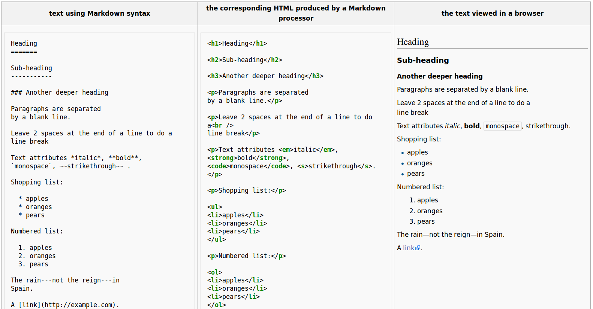

Dynamic scientific reports, literate programming, markup languages
==================================================================
author: Petr Keil
date: 19 Feb 2016, iDiv, Leipzig, Germany

Literate programming
========================================================
An article by Donald E. Knuth from 1983 is [here](http://www.literateprogramming.com/knuthweb.pdf).

 

Literate programming
========================================================
[Literate Programming](http://www.literateprogramming.com/knuthweb.pdf) is an approach in which a program is given as an explanation of the program logic in a natural language, such as English, interspersed with **snippets of macros and traditional source code**.

Markup languages
========================================================

Markup languages
========================================================
Useful in practical science:
- html
- LaTeX
- Markdown

Example documents
========================================================
- Markdown document
- R Markdown document
- R Markdown presentation
- R Markdown [manuscript](http://www.petrkeil.com/?p=2401)
- LaTeX document
- LaTeX presentation
- LaTeX [poster](http://www.petrkeil.com/?p=2467)

Markdown
========================================================
- Syntax highlighting in emacs, gedit, vim and many more.
- Editors: Atom, RStudio, Remarkable.
- Online editors: [stackedit](https://stackedit.io) 
- Used in: [GitHub](https://github.com/)

R Markdown and `knitr`
========================================================
- See [knitr website](http://yihui.name/knitr/).
- Inspired by [Sweave](http://www.statistik.lmu.de/~leisch/Sweave/).
- Useful for html documents, pdf documents (uses LaTeX), presentations.

LaTeX
========================================================

Windows users need [MikTex](http://www.miktex.org/)

Ubuntu: `sudo apt-get install texlive`

Dozens of Tex editors [here](https://en.wikipedia.org/wiki/Comparison_of_TeX_editors). I use [TexMaker](http://www.xm1math.net/texmaker/).

Dozens of [templates](http://www.latextemplates.com/).

How is it all useful?
========================================================

- Can be dynamically **updated** any time.
- **Portability** -- it works on any operating system, it is open.
- **Reproducibility** -- readers know exactly what you did.
- **Self-containment** -- the code is always functional.
- **Readability** -- reader-friendly right away (great for pre-prints).
- **Version control (Git) friendly** -- it is all code.
- Many journals accept it, and if not, dynamic reports make excellent appendices.

Drawbacks
========================================================

- **Hard to collaborate** with people who don't use markup languages (and/or Git).
- Sometimes it is just easier to do stuff in MS Word
- Can be **time consuming and tedious** to do exactly what you want
- Some journals do not accept it, see the post [here](http://www.petrkeil.com/?p=2440).

